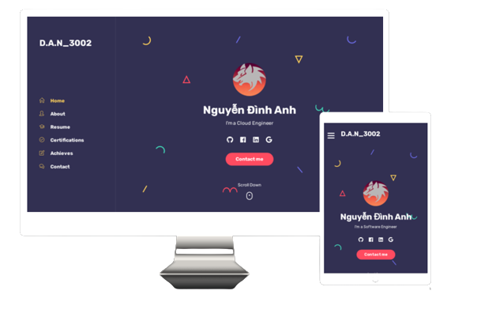

# Online Resume using React and Github API 

<!-- Add image banner and center align -->
<p align="center">
  
</p>

This is a single-page React application that displays my personal resume information and projects from Github. The application is built with React, CSS, and HTML and data is fetched from the Github API.

## Features

- Personal information display
- Github project showcase
- Responsive design

## Getting Started

These instructions will get you a copy of the project up and running on your local machine for development and testing purposes.

### Prerequisites

- Node.js
- Npm
- React

### Installing

1. Clone the repository
2. Install the dependencies

```sh
pnpm install
```

3. Start the development server
```sh
pnpm start
```

## Customize

1. To change the data displayed on the page, modify the `src/data/data.js` file.
2. To add a custom domain for your Github Page, add a `CNAME` file with your domain name.

## Deployment

The application is deployed using Github Pages and can be accessed at [https://dan3002.id.vn/](https://dan3002.id.vn/).

To deploy the application, run the following command:
```sh
pnpm run deploy
```

## Built With

- [React](https://reactjs.org/)
- [Github API](https://docs.github.com/en/rest/)
- [CSS](https://www.w3.org/Style/CSS/)
- [HTML](https://www.w3.org/html/)


## Author

- [D.A.N_3002](https://github.com/DAN3002)

## License

This project is licensed under the MIT License - see the [LICENSE.md](LICENSE.md) file for details.

The design is a modified version of the [Bolby - Portfolio/CV/Resume WordPress Theme](https://themeforest.net/item/bolby-portfoliocvresume-wordpress-theme/25981387).
